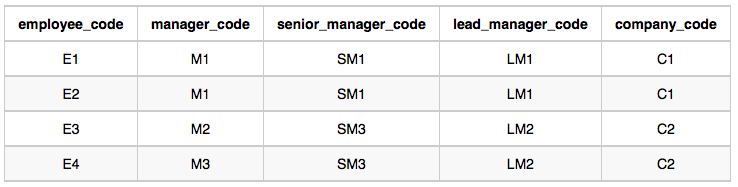

### Adding some common SQL:

**1: Binary Tree, detecting Leaf, inner, root node**

| Comumn | Type    |
|--------|---------|
| N      | Integer |
| P      | Integer |

Sample Data:

| N   | P    |
|-----|------|
| 1   | 2    |
| 3   | 2    |
| 6   | 8    |
| 9   | 8    |
| 2   | 5    |
| 8   | 5    |
| 5   | null |

```
SELECT  outerT.N,
    CASE 
        WHEN outerT.P IS NULL THEN 'Root'
        WHEN NOT EXISTS (
                SELECT  1 FROM  BST innerT WHERE  innerT.P = outerT.N
            ) THEN 'Leaf'
        ELSE 'Inner' 
    END
FROM BST outerT order by outerT.N;
```

**2:

Table structures:




Write a sql to generate the following:</br>
Sample Output:
```
C1 Monika 1 2 1 2
C2 Samantha 1 1 2 2
```

```
select c.company_code, c.founder, 
        count(distinct e.lead_manager_code), 
        count(distinct e.senior_manager_code), 
        count( distinct e.manager_code), 
        count(distinct e.employee_code) 
    from Employee e inner join Company c on c.company_code = e.company_code 
    group by 1,2 order by 1;
```

